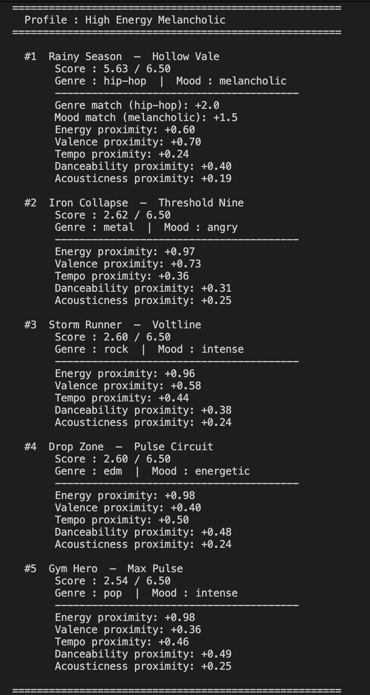
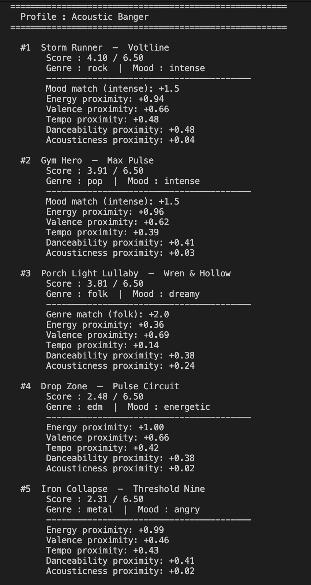
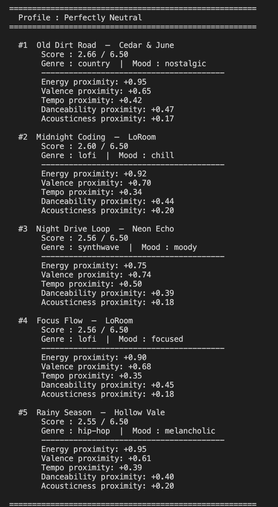

# 🎵 Music Recommender Simulation

## Project Summary

In this project you will build and explain a small music recommender system.

Your goal is to:

- Represent songs and a user "taste profile" as data
- Design a scoring rule that turns that data into recommendations
- Evaluate what your system gets right and wrong
- Reflect on how this mirrors real world AI recommenders

- This system suggests songs from a small catalog based on what kind of music a user likes
- It is for classroom use only, not for real music apps or real users
- It assumes the user can describe their taste using things like energy level, mood, and genre
- It should not be used to decide what music to promote, publish, or recommend at scale


Edge Cases:







---

## How The System Works

Explain your design in plain language.

**What features does each `Song` use?**

- `genre` — categorical label (e.g. lofi, pop, metal)
- `mood` — categorical label (e.g. chill, happy, intense)
- `energy` — float 0–1, how energetic the track feels
- `valence` — float 0–1, musical positivity
- `tempo_bpm` — integer, beats per minute
- `danceability` — float 0–1, how suitable for dancing
- `acousticness` — float 0–1, acoustic vs. electronic texture

**What information does the `UserProfile` store?**

- A target value for each of the seven features above — the user's ideal song described as a set of numbers and labels

**How does the `Recommender` compute a score for each song?**

- Every song in the catalog is scored independently using two steps:
  - **Categorical match** — `+1.0` if genre matches, `+1.5` if mood matches
  - **Numeric proximity** — for each numeric feature, compute `1 - abs(user_target - song_value)` and multiply by a weight:
    - Energy: weight `2.00` (highest priority)
    - Valence: weight `0.75`
    - Tempo BPM: weight `0.50` (normalized over a 100 BPM range)
    - Danceability: weight `0.50`
    - Acousticness: weight `0.25` (lowest priority)
  - Maximum possible score: **6.5 points**

**How are final recommendations chosen?**

- All 18 songs are scored, then sorted by score descending
- The top K songs are returned as the ranked recommendation list

**Known bias in this recipe:**

- This scoring recipe heavily prioritizes **energy** (weight 1.00) and **mood match** (+1.5 categorical bonus) — together these two features account for the majority of score variation between songs
- **Tempo, danceability, and acousticness** receive substantially lower weights (0.50, 0.50, 0.25) and contribute little to the final ranking unless all other features are tied
- As a result, two songs with very different tempos or acoustic textures can score almost identically, while a small difference in energy or a mood mismatch can separate them significantly — the system is effectively a mood-and-energy matcher with minor stylistic nuance


---

## Getting Started

### Setup

1. Create a virtual environment (optional but recommended):

   ```bash
   python -m venv .venv
   source .venv/bin/activate      # Mac or Linux
   .venv\Scripts\activate         # Windows

   ```

2. Install dependencies

```bash
pip install -r requirements.txt
```

3. Run the app:

```bash
python -m src.main
```

### Running Tests

Run the starter tests with:

```bash
pytest
```

You can add more tests in `tests/test_recommender.py`.

---

## Experiments You Tried

1. I tested eight different listener types, from normal ones like "happy pop fan" to weird ones like "someone who wants loud acoustic music."
2. I checked if the songs that came out on top actually matched what the user asked for, and if the point breakdown made sense.
3. A song with almost no acoustic quality still came out #1 for a user who specifically wanted acoustic music, because energy and mood points drowned out the mismatch.
4. I ran all eight listener types through the system and watched how the rankings changed after making energy twice as important — only pop and lofi top results stayed the same, everything else shifted significantly.

## Limitations and Risks

1. Energy weight `2.00` locks users into a narrow energy band — a gap of `0.50` fully cancels the genre bonus, creating an inescapable filter bubble.
2. 13 of 15 genres have only one song, so if that song loses on energy, the genre match is worthless and the user gets no real genre-based result.
3. 11 of 14 moods map to a single song each — if that song has poor energy proximity, the `+1.5` mood bonus effectively disappears.
4. No artist diversity check means the same artist can appear twice in the top 5, making results feel repetitive for the user.
5. The BPM window divides by `100` but the catalog spans `108 BPM`, so songs at tempo extremes score zero even when they are the closest available match.

---

## Reflection

[**Model Card**](model_card.md)

- Building this showed that even a basic point system can produce surprisingly reasonable song picks.
- My biggest learning moment in this project was understanding the complex mathematics behind the recommendation system. I am an avid math geek and this taught how it is implemented in complex large-scale recommendation systems.
- The biggest surprise was how much one weight change (doubling energy) shifted almost every ranking across all profiles.
- Using AI tools helped me a lot. I was successfully able to brainstorm, figure out where my recommendation system was lacking, and was also able to expand on my data set using AI. Some instances where I had to double-check AI's work would definitely be developing new specific user preferences, as initially it gave me extremely vague user preferences. I had to give it my own preferences as an example to enhance its output.
- It made me realize that real apps like Spotify probably have hundreds of these weights, all carefully tuned behind the scenes.
- If I were to extend this project, I would definitely make my recommendation more robust by including more parameters for judging a song, maybe even researching what are the main characteristics of a song, by looking at official documentation of platforms like Spotify and Apple Music. Drawing inspiration from them, I would want to include an enhanced AI DJ, which is powered by an AI voice — pretty much giving a "voice" to the recommendation system.

---

## 7. Model Card

# 🎧 Model Card: Music Recommender Simulation

## 1. Model Name

Give your model a short, descriptive name.
Example: **Spoti5 v6.7**

---

## 2. Intended Use

- This system suggests songs from a small catalog based on what kind of music a user likes
- It is for classroom use only, not for real music apps or real users
- It assumes the user can describe their taste using things like energy level, mood, and genre
- It should not be used to decide what music to promote, publish, or recommend at scale

---

## 3. How the Model Works

- Every song gets a score by comparing its features to what the user said they like
- If the genre matches, the song gets +1 point; if the mood matches, it gets +1.5 points
- Energy is the biggest number factor — the closer a song's energy is to the user's target, the more points it earns (up to 2 points)
- Valence, tempo, danceability, and acousticness each add a smaller amount on top
- All 18 songs are scored, sorted from highest to lowest, and the top ones are shown

---

## 4. Data

- The catalog has 18 songs across 15 genres and 14 moods
- Most genres and moods only have one song each, which limits how varied the results can be
- No songs were added or removed from the original dataset
- The data does not capture lyrics, language, cultural background, or artist popularity

---

## 5. Strengths

- Works best for pop and lofi users since those are the only genres with more than one song
- When genre, mood, and energy all match, the top result feels obviously correct
- The score breakdown shows exactly why each song was picked, which makes it easy to understand and trust
- Simple, clear profiles like "happy pop" or "chill lofi" get near-perfect top results

---

## 6. Limitations and Bias

1. Energy weight `2.00` locks users into a narrow energy band — a gap of `0.50` fully cancels the genre bonus, creating an inescapable filter bubble.
2. 13 of 15 genres have only one song, so if that song loses on energy, the genre match is worthless and the user gets no real genre-based result.
3. 11 of 14 moods map to a single song each — if that song has poor energy proximity, the `+1.5` mood bonus effectively disappears.
4. No artist diversity check means the same artist can appear twice in the top 5, making results feel repetitive for the user.
5. The BPM window divides by `100` but the catalog spans `108 BPM`, so songs at tempo extremes score zero even when they are the closest available match.

---

## 7. Evaluation

1. I tested eight different listener types, from normal ones like "happy pop fan" to weird ones like "someone who wants loud acoustic music."
2. I checked if the songs that came out on top actually matched what the user asked for, and if the point breakdown made sense.
3. A song with almost no acoustic quality still came out #1 for a user who specifically wanted acoustic music, because energy and mood points drowned out the mismatch.
4. I ran all eight listener types through the system and watched how the rankings changed after making energy twice as important.

---

## 8. Future Work

- Stop the same artist from showing up more than once in the top results
- Expand the catalog so every genre and mood has at least 3–5 songs to choose from
- Fix the BPM normalization to use the actual range of the catalog instead of a fixed window of 100

---

## 9. Personal Reflection

- Building this showed that even a basic point system can produce surprisingly reasonable song picks.
- My biggest learning moment in this project was understanding the complex mathematics behind the recommendation system. I am an avid math geek and this taught how it is implemented in complex large-scale recommendation systems.
- The biggest surprise was how much one weight change (doubling energy) shifted almost every ranking across all profiles.
- Using AI tools helped me a lot. I was successfully able to brainstorm, figure out where my recommendation system was lacking, and was also able to expand on my data set using AI. Some instances where I had to double-check AI's work would definitely be developing new specific user preferences, as initially it gave me extremely vague user preferences. I had to give it my own preferences as an example to enhance its output.
- It made me realize that real apps like Spotify probably have hundreds of these weights, all carefully tuned behind the scenes.
- If I were to extend this project, I would definitely make my recommendation more robust by including more parameters for judging a song, maybe even researching what are the main characteristics of a song, by looking at official documentation of platforms like Spotify and Apple Music. Drawing inspiration from them, I would want to include an enhanced AI DJ, which is powered by an AI voice — pretty much giving a "voice" to the recommendation system that I would develop.
